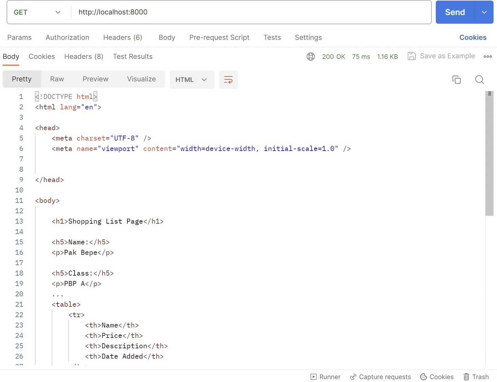
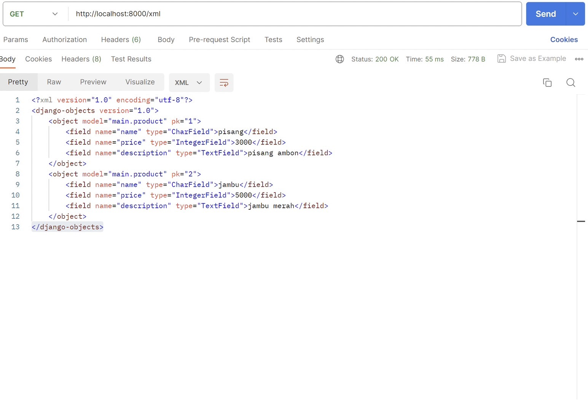
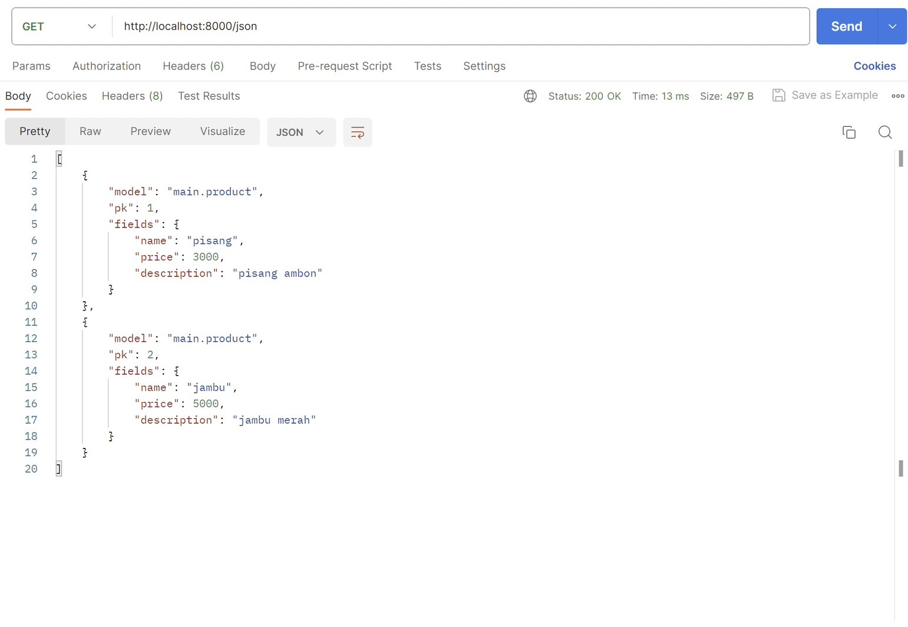
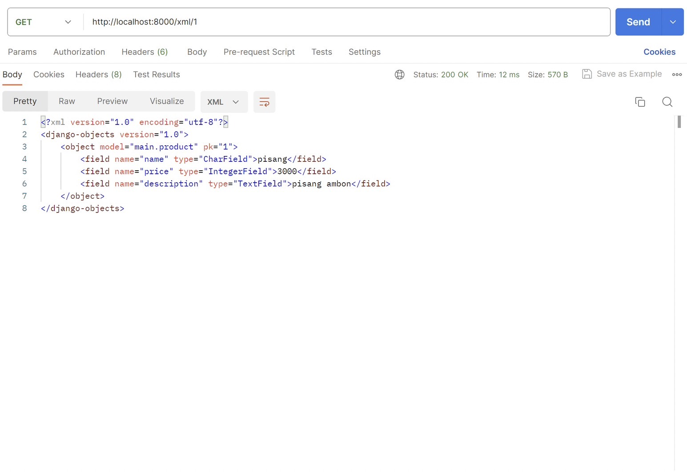

1. Apa perbedaan antara form POST dan form GET dalam Django?
    Dalam form POST, data dikirim ke server dalam body permintaan HTTP. Ini berarti data tidak terlihat dalam URL browser. form post biasanya digunakan ketika ingin mengirim data ke server untuk membuat, memperbarui, atau menghapus data yang akan mengubah status atau isi server.

    Sementara itu, Form GET digunakan untuk mengambil data dari server dan menampilkan data tersebut dalam URL. Data yang dikirim melalui Form GET akan terlihat di URL dan digunakan untuk permintaan yang hanya mengambil informasi dari server tanpa melakukan perubahan pada data yang ada. Contohnya, saat melakukan pencarian atau filtering berdasarkan kriteria tertentu.

2. Apa perbedaan utama antara XML, JSON, dan HTML dalam konteks pengiriman data?
    Perbedaan utama dari XML, JSON, dan HTML dalam konteks pengiriman data terletak pada struktur datanya. XML adalah bahasa markup yang sangat fleksibel dan dapat digunakan untuk mendefinisikan struktur data sesuai kebutuhan. Ini menggunakan tags yang dapat disesuaikan untuk menggambarkan hierarki data yang kompleks. Untuk struktur data JSON adalah format data yang lebih ringkas dan sederhana. Data diwakili dalam bentuk pasangan "nama-nilai" (key-value pairs) dan memiliki struktur yang mirip dengan objek JavaScript. Sementara untuk struktur data HTML memiliki struktur tetap dengan elemen-elemen seperti heading, paragraph, dan link yang digunakan untuk membuat halaman web.

3. Mengapa JSON sering digunakan dalam pertukaran data antara aplikasi web modern?
    JSON (JavaScript Object Notation) sering digunakan dalam pertukaran data antara aplikasi web modern karena memiliki beberapa keunggulan yang membuatnya sangat cocok untuk lingkungan web dan pengembangan aplikasi saat ini. Salah satunya adalah JSON menyajikan data yang simple dan compact sehingga pemrosesan data lebih efisien. keunggulan JSON selanjutnya adalah dapat membaantu mengonversi data ke dalam tek syang dapat dipahami manusia. Hal ini membantu mempermudah proses perbaikan, pencarian, atau penambahan kode. 

4. Jelaskan bagaimana cara kamu mengimplementasikan checklist di atas secara step-by-step (bukan hanya sekadar mengikuti tutorial).
    - pada awalnya saya membuat suatu skeleton yang berfungsi sebagai kerangka views dari situs web, membuat struktur form yang dapat menerima data baru dengan membuat model untuk form dan field.
    - kemudian saya membuat form sederhana untuk menginput data barang pada aplikasi dan menampilkan data produk dalam HTML dengan membuat fungsi create product yang menerima parameter request POST.
    - kemudian meng-import fungsi create produk di urls main dan menambahkan path url untuk mengakses fungsi create product.
    - kemudian saya membuat create product html dan menambahkan tombol "add new product" pada main.html.
    - selanjutnya saya membuat 4 fungsi baru untuk mengubah data menjadi bentuk XML, JSON, XML BY ID, DAN JSON_BY_ID dengan menggunakan method serializers

Screenshot hasil akses URL pada postman:

